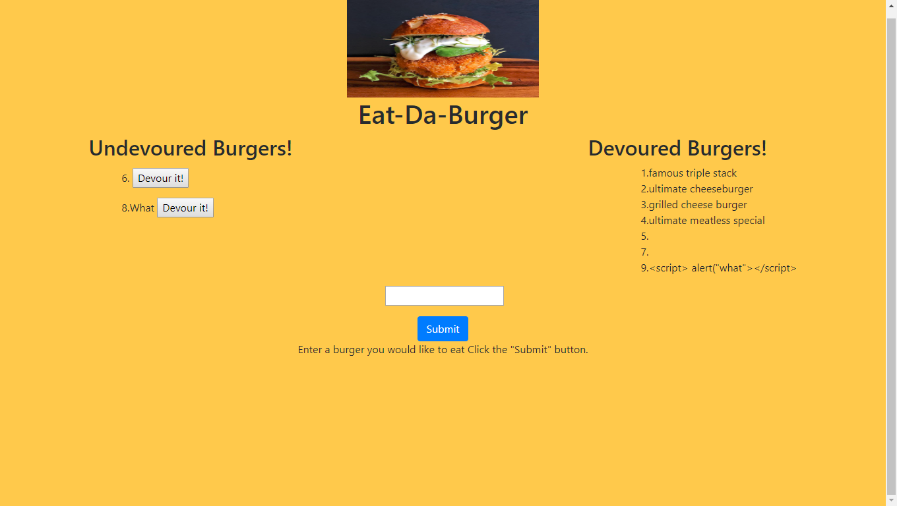

# burger
--------

## Hungry have a burger the only place where you can type in a burger and devour it instantly.
---------

### Programs used
---------

1. Javascript
2. Node
3. MySql
4. Sequelize
5. Handlebars
6. MySql npm package
7. Body-Parser npm package

### How the app works.

1. First create a new databse in mysql called sqlburgers_db.
2. run the app using node in the terminal to call the server.js file.
3. Take the PORT number given in the terminal and open up a web page and type in localhost:(Port number Here) in the address bar.
4. You can the enter in the burger you would like to eat it the text box and submit it.
5. It will then pop up under the undevoured section along with a button which says Devour it!
6. If devour it is clicked the burger will then be moved over to the devoured section on the page.
7. All the burgers will be saved to the MySql database along with the the updated version of the burger if it is devoured.
8. The burgers will be put in order in the devoured section the same way in which they were added to the undevoured section even if they are devoured in a different order in which they are added.

-----------------
## App link
[App](https://intense-garden-77079.herokuapp.com/)

